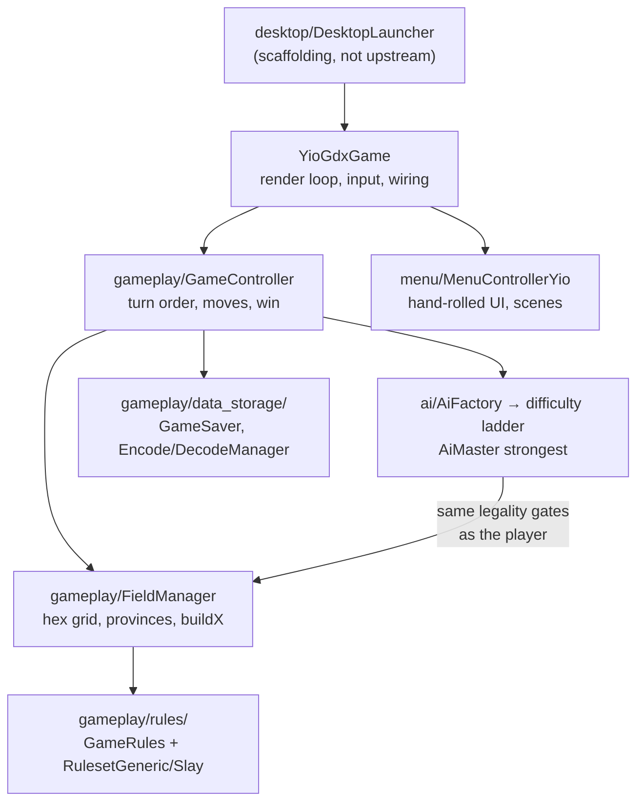

# Key decisions

This repo is essentially unmodified upstream antiyoy plus a small desktop build
scaffold. There are few fork-specific decisions; what matters is (a) the upstream
design choices any change must respect, and (b) the scaffolding decisions of this
setup. Behavior details live in [overview.md](overview.md); this file records the
decisions and their rationale.

## System overview

## Upstream design choices to respect

| Decision | Rationale / consequence |
| --- | --- |
| **Rank-based combat, no HP** | `RulesetGeneric.canUnitAttackHex` compares unit `strength` (1–4, 4 beats all) against `Hex.getDefenseNumber()`; captures are all-or-nothing. There is no damage, no `UnitType`, no battle package — do not document or assume one |
| **Hand-rolled UI, no Scene2D widgets** | Menus are `menu/scenes/Scene*` classes wiring `ButtonYio` / `InterfaceElement` objects through `MenuControllerYio`. New UI must follow this pattern, not libGDX Scene2D |
| **`FactorYio` animation system** | All animation state is an eased float (`appear()` to start, `move()` per frame, `get()` to read) with pluggable `MoveBehavior` easings. No tweening library; reuse `FactorYio` for anything animated |
| **String-encoded saves via `Preferences`** | `GameSaver` writes hand-rolled token strings (see `EncodeManager` / `LegacyExportManager.getFullLevelString`, slash/space-delimited). Extend formats append-only; never introduce Java serialization — old saves and shared level codes must keep loading |
| **Append-only `Obj` ids** | `gameplay/Obj` int constants (`PINE`=1 ... `STRONG_TOWER`=7) are baked into saved strings and level codes. New ids go at the end; existing ids never change meaning |
| **Tunables centralized in `GameRules`** | Prices, taxes, `UNIT_MOVE_LIMIT` and all static mode flags live in `gameplay/rules/GameRules.java`. Balance changes go there, not inline |
| **AI shares the player's legality gates** | AI classes go through the same `Ruleset` / `MoveZoneDetection` checks; rule changes apply to the AI automatically |
| **`System.out.println` logging, no framework** | ~240 call sites; keep it that way |
| **Java 6-era code style** | No lambdas, streams or `var` anywhere in `core/src`; match the surrounding style even though the build compiles at level 8 |
| **No test framework** | `gameplay/tests/` is in-game debug screens. Verification is `make run` plus the level editor |

## Scaffolding decisions (this setup, not upstream)

Upstream ships only `core/src` + `assets`. The root `build.gradle`,
`settings.gradle`, Gradle wrapper, `Makefile` and the `desktop` module were added
here so the game builds and runs without the gdx-setup tool
(see [RUNNING.md](../../RUNNING.md)).

| Decision | Rationale |
| --- | --- |
| **libGDX pinned to 1.9.10** | 1.9.11 changed `InputProcessor.scrolled()` from `(int)` to `(float, float)`; `YioGdxGame` implements the old signature (`scrolled(int amount)`), so anything newer fails to compile. Bumping libGDX means patching `YioGdxGame.java` — left alone so upstream source stays pristine |
| **Java 8 compatibility override in root `build.gradle`** | Upstream `core/build.gradle` pins `sourceCompatibility` to 1.6, which javac 21 rejects (8 is the floor). The root build overrides it to 8 in a `subprojects { afterEvaluate }` block rather than editing the upstream file |
| **`:desktop:run` sets `workingDir` to `assets/`** | Every asset loads by bare relative path (`Gdx.files.internal("splash.png")`), so the process must start inside `assets/`. Launching any other way yields missing-asset crashes |
| **Makefile locates the JDK** | `make run` / `make build` find a JDK under `~/.local/opt/jdk-21*` or respect `JAVA_HOME`; Gradle comes from the bundled wrapper |
| **Upstream files untouched** | `core/build.gradle` and everything under `core/src` are unmodified; all scaffolding lives at the root and in `desktop/` so the diff against upstream stays reviewable |
